## 항해 플러스 백엔드 WIL - 3, 4주차 회고

최초 업로드 2025-08-03 / 마지막 수정 2025-08-03

## ** 3주차 피드백 **

1주차 때 bp를 받고 3주차 때 예기치 않은 fail을 받았다. fail은 당연히 안 받고 끝날 줄 알았는데 충격적이었다. 나는 코치님이 왜 fail을 주었는지 그 관점은 이해한다. 결국 계층 간의 깊은 고민이 느껴지지 않았다인데, 특히 application-service 코드가 지저분한 것은 사실이었다. 그리고 내가 더 잘 할 수 있음을 아셨기에 fail을 주었다고 생각했다. 많이 아쉽긴했다. 나름 고민이 많이 들어간 상태였고 convention과 unconvention 사이에서 어떻게 줄다리기를 해야할지 고민하며 3주차 코드 작성을 했기 때문이다. (심지어 연차쓰고 40~50시간 정도 사용함.)

코치님께서 주신 피드백은 다음과 유사한 내용이었다:

> _자고로 클린 아키텍처란 domain-service에 단일 도메인을 가두고 usecase에서는 여러 도메인을 조립해야한다. 그리고 usecase는 controller과 1대1 대응이 되는 것이 좋다._

나는 매우 비동의하는 부분이 많았다. 일단 내 과제가 fail된 이유는 application service에 facade도 있어야하고 뭐가 많았기 때문인데, 그렇다면 domain-service로 그걸 내려봤자 domain-service에서도 똑같이 내부 계층을 가지고 있어야 순환참조가 발생하지 않는다.

그래서 4주차 과제에서는 나는 코치님의 피드백을 진심으로 해결하려면 (순환참조 문제) 코치님이 제안하신 솔루션도 그리 좋은 솔루션은 아니라고 생각했다. 결국 어디 계층엔가는 다계층이 생길 수 밖에 없어보였다. 그리고 그 네이밍은 프로젝트마다 조금씩 사용처가 달라서 헷갈리기만 한다. Facade, service, orchestrator, usecase 이거 모두 결국 똑같은 이야기를 하는건데 조금씩 뉘앙스차이가 있고 프로젝트마다 정확히 어떻게 저 용어를 쓰는지는 조금씩 다르다. 이 답답함을 해소하고자 이번주 여행을 가면서 고민을 조금했었다.

다낭으로 향하는 비행기에 탑승하고 한 시간 정도 고민했을 때 떠오른 것은 tiered arhictecture이었다. 예전에 db 시딩할 때 foreign key constraint 유지하면서 시딩하고 싶어서 티어로 순서를 나누었던 기억이 났다. 이거랑 유사하게 가야한다고 생각했고 usecase 계층을 여러개로 나누기로 했다. 그리하여 아래와 같은 아키텍처를 만들었다. 이제 Facade, service, orchestrator, usecase 이런 용어들을 어떻게 조합해서 순환참조를 해결하지?라고 고민할 시간에 무지성으로 무조건 하위 티어만 import 가능하면 끝이 되도록하면 되었다.

```mermaid
graph TD
    %% Presentation Layer
    subgraph "Presentation Layer"
        Order_Controller["OrderController"]
        User_Controller["UserController"]
    end

    %% Application Layer - Tiers
    subgraph "Application Layer (UseCases)"
        %% Tier-3
        subgraph "Tier-3"
            T3_PlaceOrder["PlaceOrderUseCase"]
        end

        %% Tier-2
        subgraph "Tier-2"
            T2_ProcessOrder["ProcessOrderUseCase"]
            T2_CreateUserWithWallet["CreateUserWithWalletUseCase"]
        end

        %% Tier-1
        subgraph "Tier-1(in-domain)"
            T1_CreateOrder["CreateOrderUseCase"]
            T1_UsePoints["UsePointsUseCase"]
            T1_CreateUser["CreateUserUseCase"]
            T1_CreateWallet["CreateWalletUseCase"]
        end
    end

    %% Domain Layer
    subgraph "Domain Layer"
        DS_ValidateOrder["ValidateOrderService"]
        DS_ValidateUser["ValidateUserService"]
        DS_ValidatePoint["ValidatePointService"]
    end


    %% Controller -> UseCase (어떤 tier든 직접 호출)
    Order_Controller -.-> T3_PlaceOrder
    User_Controller -.-> T2_CreateUserWithWallet
    Order_Controller -.-> T1_UsePoints

    %% UseCase Tier Dependencies (상위 -> 하위만)
    T3_PlaceOrder --> T2_ProcessOrder
    T2_ProcessOrder --> T1_CreateOrder
    T2_ProcessOrder --> T1_UsePoints
    T2_CreateUserWithWallet --> T1_CreateUser
    T2_CreateUserWithWallet --> T1_CreateWallet

    %% UseCase -> Domain Service
    T1_CreateOrder --> DS_ValidateOrder
    T1_UsePoints --> DS_ValidatePoint
    T1_CreateUser --> DS_ValidateUser

    %% 색상 및 스타일
    classDef controller fill:#333,stroke:#01579b,stroke-width:2px
    classDef tier3 fill:#333,stroke:#e65100,stroke-width:2px
    classDef tier2 fill:#333,stroke:#4a148c,stroke-width:2px
    classDef tier1 fill:#333,stroke:#1b5e20,stroke-width:2px
    classDef service fill:#333,stroke:#ff6f00,stroke-width:2px
    classDef repo fill:#333,stroke:#880e4f,stroke-width:2px

    class Controller controller
    class T3_PlaceOrder tier3
    class T2_ProcessOrder,T2_CreateUserWithWallet tier2
    class T1_CreateOrder,T1_UsePoints,T1_CreateUser,T1_CreateWallet tier1
    class DS_ValidateOrder,DS_ValidateUser,DS_ValidatePoint service
    class Repo_Order,Repo_User,Repo_Point repo
```

#### 규칙 설명 (README 발췌)

- 상위 티어는 하위티어만 import할 수 있도록 eslint를 설정해두었습니다.
- presentation 레이어에서는 티어 상관없이 바로 가져다가 사용할 수 있습니다.
- 티어는 무한히 쌓을 수 있습니다.
- 아래 완화책에 나온 것처럼 여러 장치를 마련해서 티어들에 추가적인 규칙을 부여할 수 있습니다.
- 위 그림에서는 tier 1은 동일 도메인 내의 도메인 서비스만 import 가능합니다.

위 설명에 대한 더 자세한 3주차 마무리의 상태는 - 해당 커밋 히스토리의 스냅샷으로 볼 수 있다: [#](https://github.com/seho0808/hh-9-be-2/tree/0bb29ddb7477467bb60060aa22f9fd43dcf9b467)

 

## ** 4주차 피드백 **

내가 4주차 때 만든 것은 한 번도 보지 못한 아키텍처이었고 구글에 검색해봐도 나랑 비슷하게 구조를 짠 예시가 없어서 살짝 도박이라고 느꼈다. 하지만 다행히도 4주차에서 bp를 받을 수 있었다. 과제 fail 받는거 두려워서 정해진 길을 가는 것 보다 최대한 많이 배우고 시도해보고자 하는 마음이 컸다. 음... 이번주에도 tier중 하나를 orchestrator로 하면 어떻겠냐는 피드백을 받았는데, 나는 아직 orchestrator로 하는 것보다 tier로 퉁치는게 나아보이긴한다. usecase라는 것이 외부에 노출도 되어야하고 조립도 되어야하는 개체이면 그냥 모두 usecase라고 명명하는게 좋아보인다.

이번주(5주차)는 트랜잭션과 단일 db lock에 대한 동시성 관리를 고민하는 찹터이다. 매 주차 완벽하게 해내려하기보다 핵심적인 개념들을 잘 이해하는 것에 집중하자. 어차피 과정 끝나고 각 찹터 1주일씩했던 것들 모두 2달씩은 보충해서 20개월은 추가로 최소한 공부해야 아주 기본적인 것들을 이해할 수 있어보인다.
