## **AMQP Specification Review (section 2.1 only)**

Initial Upload 2025-06-08 / Latest Modification 2025-06-08

_Summary and review of the amqp spec section 2.1_

This review is based on the spec at https://www.rabbitmq.com/amqp-0-9-1-protocol.

It is only 40 pages written in plain english. (0-9-1)

I tried to read through section 2.1 only (the main architecture part)

### My overall thought on section 2.1

the most important bits:

1. It first seemed like everything is setup, but it is much more flexible at RUNTIME

   - exchange is more or less controlled by the producer. (at least that seems like the best practice)
   - queue is more or less controlled by the consumer. (at least that seems like the best practice)
   - there are cases where one application creates a mq for itself and removed that queue on runtime.

2. Transactions, cutting off connections

   - there are weird details I found which is not necessarily obvious.
   - transactions exist.
   - when any error occurs, entire channel or connection is simply closed.

### Paraphrased Version

Below is what I paraphrased section 2.1 into a little bit easier format. 🌟 is my thoughts and I wanted to highlight them. It makes contents easier to digest.
Only the code + mermaid of this article is generated by gpt.

### 2.1.1 Main Entities

### 2.1.1.1 The Message Queue

You can build queues various properties. Detailed options are not formally defined in AMQP.

Examples of what you can build:

- store-and-forward queue => durable + shared
  - 🌟 durable + shared means queue is supposed to live forever + shared between queue consumers.
- private reply queue => temporary + server-named + exclusive
  - 🌟 means queue can die at any moment + the amqp server generates random server name + cosumed by one consumer.
  - 🌟 `channel.assertQueue('', { exclusive: true });` => `amq.gen-7sf9QJYV9x0yCwI8Qlq0vA`
- private subscription queue => temporary + server-named + exclusive

### 2.1.1.2 The Exchange

- Exchanges === matching and routing engines
- Exchange type VS instance!
  - Exchange type?
    - fundamental types of routing needed. The CLASS, or blueprint of how the exchange should work.
  - Exchange instance?
    - default instances + the exchanges you initialize (🌟 in rabbitmq management dashboard, you can see the default exchanges when you boot up.)
  - 🌟 type & instance here seems almost identical to OOP class & instance
- Exchange is intended to add extensibility to AMQP for interoperability
  - 🌟 this means => Since we need to allow Java - JS - Python - multiple different environments to be communicable via AMQP (interoperability), we needed to create Exchange within AMQP protocol to handle complex situations.

### 2.1.1.3 The Routing Key

- routing key is **only used within the server**.
- it is used with different algorithms for different exchange types.

### 2.1.1.4 Analogy to Email

- AMQP message ≈ email message
- queue ≈ mailbox
- consumer ≈ mail client (gmail) that reads and delets email
- exchanges ≈ MTA (mail transfer agent)
- routing key ≈ email To:, Cc: address
- binding ≈ MTA routing table

the difference:

- amqp is for internal services (store messages within a server)
- VS email servers send emails here and there between servers.

you need to setup explicit bridges for amqp - amqp server connection

### 2.1.2 Message Flow

### 2.1.2.1 Message Life-cycle

```mermaid
flowchart TD
    A[Producer creates Message]
    B[📝 Adds Content +
    Properties + Routing Info]
    C[📮 Sends Message to
    Exchange]
    D{🔀 Can the Exchange
    Route it?}
    E1[🗑️ Drop or Return]
    E2[➡️ Route to One
    or More Queues]
    F[📥 Message Arrives
    in Queue]
    G{👀 Is a Consumer
    Available?}
    H1[📨 Deliver
    Immediately]
    H2[💾 Store in Memory
     or Disk]
    I[📬 Deliver to Consumer]
    J{✅ Consumer Ack?}
    K1[🧹 Remove from Queue]
    K2[⛔ Reject - Nack]

    subgraph Transaction
      L1[📦 Grouped Producer
      Messages]
      L2[🧾 Grouped Consumer Acks]
      L3[✅ Commit or ❌ Rollback]
    end

    A --> B --> C --> D
    D -- No --> E1
    D -- Yes --> E2 --> F --> G
    G -- Yes --> H1 --> I
    G -- No --> H2
    I --> J
    J -- Ack --> K1
    J -- Nack --> K2
    A --> L1
    J --> L2
    L1 --> L3
    L2 --> L3

```

- 🌟 I was surprised there was transaction feature in amqp.

### 2.1.2.2 What The Producer Sees

- messages never goes directly to queues.
- messages should always go through exchange(s).
- producer only sees exchange(s).

### 2.1.2.3 What The Consumer Sees

- consumer sees a lot more than a simple email consumer.
  - can create or destroy mqs
  - can make bindings. (bindings define how the mq is filled)
  - select different exchanges

### 2.1.2.4 Automatic Mode

there is default mode since amqp don't need to be all this complicated in most cases:

- default exchange exists
- default routing logic: routing key is mapped to the queue of the same name.

### 2.1.3 Exchanges

### 2.1.3.1 Types of Exchange

- direct: routing key exact match
- topic: routing key pattern match (\*, \#)
  - 🌟 \* is any single word and \# is zero or multiple words

there are others specified in "Functional Specification" Section

### 2.1.3.2 Exchange Life-cycle

- default exchanges are not removeable.
- there is no "create exchange" but rather "declare exchange" which means something similar to what we do in dbs: "CREATE 'x' IF NOT EXISTS"
- it is uncommon to remove exchanges.

### 2.1.4 Message Queues

### 2.1.4.1 Message Queue Properties

- name:
  - bp is to use random name generated by server if a single application is using it for its own purpose
  - otherwise, set it up front, cohering to other applications which use the same queues.
- exclusive:
  - current connection only
  - deleted when connection closes
- durable:
  - queue remains present and active when server restarts.
  - might lose message when server restarts though!

### 2.1.4.2 Queue Life-cycles

two main types + possible other types.

- Durable MQ: lives even though nobody is consuming
- Temporary MQ: deleted when consumer disconnects
- Shared MQ: deleted when last consumer disconnects
- x MQ: might be other patterns as well.

### 2.1.5 Bindings

- bindings = logic for exchange to mq
- constructed from the client application (one owning the mq)

### 2.1.5.1 Constructing a Shared Queue

- wip

### 2.1.5.2 Constructing a Reply Queue

- wip

### 2.1.5.3 Constructing a Pub-Sub Subscription Queue

- wip
