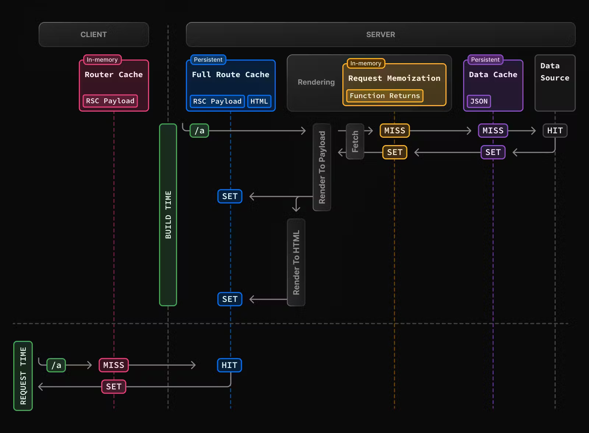

## **Next js 13에서 추가된 캐싱 기능들을 정리해보자 \[1편\]**

<p class="text-time">최초 업로드 2023-11-21 / 마지막 수정 2023-12-28</p>

<br/>

## **<1> 개요**

13버전이 stable 버전으로 배포된지 6개월만에 벌써 Next.js 14가 출시되었지만, 13에서 추가된 기능들이 많아서 꼼꼼하게 짚고 넘어갈 필요가 있다.
다른 feature들은 어느정도 직관적으로 이해가 되는 면이 있었지만, 캐싱 부분 만큼은 내용이 복잡하고 새로운 디테일이 많아서 따로 정리해본다.

<br/>

## **<2> 개략적 흐름**

<!-- 

 -->

<div class="image-container">
  
  <sub class>그림 1. Next.js 웹사이트 원본</sub>
</div>

<br/>

[Next.js 13 공식문서](https://nextjs.org/docs/app/building-your-application/caching)에는 네 개의 캐싱 기법이 정리되어있다. Router Cache, Full Route Cache, Request Memoization, Data Cache 이렇게 네 가지가 공식 문서에
소개가 되어있다. 처음 이 내용을 접했을 때, 너무 복잡해서 이해가 어려웠는데, 다행히도 2023년 8월 즈음에 그림들과 함께 설명이 매우 깔끔하게 업데이트되어서 이해가 수월해졌다. 재미있는 점은,
Next.js로 개발하는 사람들은 상당수가 풀스택에 가까운 프론트엔드 개발자들일 것이라, 해당 그림에서 나오는 캐싱 기법이 전부가 아니다.

일단 몇 년 전부터 전통적으로 써오던 useSWR과, 선택에 따라서 추가되는 DB 캐싱이 추가로 존재한다. 게다가, 커스텀으로 [React cache](https://react.dev/reference/react/cache)를
사용해줄 수도 있다. 이에 맞춰서 그림을 조금 수정해보았다.

<br/>

<div class="image-container">
  
  <sub class>그림 2. 실제로 고려해야되는 캐싱들</a></sub>
</div>

<br/>

위 그림은 나중에 더 자세히 다루고, 이번 1편 포스트에서는 Router Cache에 대해서 알아보자.

일단 이름이 비슷한 Router Cache와 Full Route Cache의 차이점에 대해 알아볼 필요가 있는데, 공식 문서에 의하면,

- Difference between the Router Cache and Full Route Cache:

  - The Router Cache temporarily stores the React Server Component Payload in the browser for the duration of a user session, whereas the Full Route Cache persistently stores the React Server Component Payload and HTML on the server across multiple user requests.

    => Router Cache는 <span class="text-red">브라우저에 RSC 페이로드를 잠깐!</span> 저장하고 Full Route Cache는 <span class="text-blue">서버에 RSC 페이로드와 HTML을 오래~</span> 저장한다.

  - While the Full Route Cache only caches statically rendered routes, the Router Cache applies to both statically and dynamically rendered routes.

    => Router Cache는 <span class="text-red">static과 dynamic 페이지를 모두~</span> 저장하고 Full Route Cache는 <span class="text-blue">static한 페이지만!</span> 저장한다.

쉽게 말하면 둘은 상호보완적이지만 완전히 별개의 개념이다. RSC 페이로드를 서버에 저장하느냐, 아니면 브라우저에 저장하느냐의 차이이다.
RSC 페이로드는 React Server Component가 등장하면서 부분적으로 렌더된 리액트 정보를 프론트로 넘겨주기 위해 만들어진 바이너리 파일 형식이다. RSC에 대한 개념은 필자 또한 공부가 필요하기에 다른 포스트로 정리한 뒤 완성되면 여기에 링크를 걸겠다.

<br/>

## **<3> Router Cache 이해하기**

공식 문서의 핵심은 이 부분이다.

- The cache is stored in the browser's temporary memory. Two factors determine how long the router cache lasts:

  => Router Cache는 <span class="text-orange">두 가지 변수</span>에 컨트롤됩니다.

  - Session: The cache persists across navigation. However, it's cleared on page refresh.

  => 페이지 이동 시 이전 페이지의 데이터는 캐싱됩니다. <span class="text-orange">새로고침</span>을 하면 데이터가 다시 불러와집니다.

  - Automatic Invalidation Period: The cache of an individual segment is automatically invalidated after a specific time. The duration depends on whether the route is statically or dynamically rendered:

    - Dynamically Rendered: 30 seconds
    - Statically Rendered: 5 minutes

  => 각 세그먼트(이동 하면서 저장된 모든 페이지) 마다 <span class="text-orange">dynamic일 경우 30초, static일 경우 5분 주기</span>로 캐싱됩니다.

**<span class="text-orange">Router Cache 한줄 요약: 앱에서 방문한 모든 페이지의 리액트 서버 컴포넌트를 캐싱하여 페이지 재방문 시 로딩을 빠르게 해주고, 새로고침 시 & 주기적으로 데이터를 새로 가져와서 페이지 별 cache가 refresh(invalidate)된다.</span>**

위에서 빠진 디테일:

1. next/link의 <span class="text-red">Link 컴포넌트를 사용하면 prefetch로 캐싱이 된다.</span> Link 컴포넌트는 default로 fetch={true}이기에, 방문한 페이지가 아니어도
   자동으로 Router Cache에 의해 캐싱이 된다!!!

2. 애초에 Router Cache는 RSC 페이로드를 저장하는 것이기 때문에 서버 컴포넌트가 아닌 <span class="text-red">클라이언트 컴포넌트("use client")에서 작동하는 코드는 캐싱되지 않는다!!!</span>

3. Router Cache는 절대로 Opt Out이 안된다. React Server Component가 있으면 무조건 사용된다.

<br/>

제대로 된 이해를 위해 예시를 한 가지 살펴보자. 읽기 쉽게 4개의 파일을 하나의 코드 블록에 넣어보았다.

<br/>

```javascript

// app/api/getTime
// 이 api는 시간을 리턴해줌!
export const dynamic = "force-dynamic"; // 이거 없으면 빌드 시 static route돼서 같은 시간만 주구장창 나옴
export async function GET() {
  return Response.json({ timestamp: new Date().getTime() });
}

// components/FromServer.tsx
// 서버에서 api를 호출 후 렌더링!
export default async function FromServer() {
  const data = await fetch("http://localhost:3000/api/getTime", {
    cache: "no-store", // fetch에 대한 설명은 2편에서 보고, 일단은 넘어가자.
  });
  const { timestamp } = await data.json();
  return <div>{timestamp}</div>;
}

// components/FromClient.tsx
// 클라이언트에서 api를 호출 후 렌더링!
"use client";
export default function FromClient() {
  const [timestamp, setTimestamp] = useState(0);

  useEffect(() => {
    const getData = async () => {
      const data = await fetch("http://localhost:3000/api/getTime", {
        cache: "no-store", // fetch에 대한 설명은 2편에서 보고, 일단은 넘어가자.
      });
      const { timestamp } = await data.json();
      setTimestamp(timestamp);
    };
    getData();
  }, []);

  return <div>{timestamp}</div>;
}

// app/page.tsx
// /hello 페이지랑 현 페이지랑 왔다 갔다하면 Client만 수치가 계속 바뀌고 Server은 캐싱 시간만큼 유지!
export default function Home() {
  return (
    <main className="flex min-h-screen flex-col items-center justify-between p-24">
      <div>
        From Client: <FromClient />
      </div>
      <div>
        From Server: <FromServer />
      </div>
      <div>this is home page</div>
      <Link href="/hello">go to hello page</Link>
    </main>
  );
}


```

<br/>

먼저 `app/api/getTime`은 Route Handler 형식으로, Next.js 웹 서버에서 핸들링하는 API 엔드포인트이다. 시간을 리턴한다.
이 데이터를 각각 <span class="text-blue">서버 컴포넌트와 클라이언트 컴포넌트에서 똑같이 가져와서 표기해준다.</span> 그리고 이 두 개의 컴포넌트를 `app/page.tsx`에서 가져오는데, 해당 페이지의 링크로 다른 페이지와 갔다가 왔다가 해보면 클라이언트 컴포넌트<span class="text-red">만</span> 시간이 계속 바뀌는 것을 볼 수 있다.

바로 Router Cache 때문에 서버 컴포넌트의 RSC 페이로드가 캐싱되는 것이다.

<div class="image-container">
  
  <sub class>그림 3. Router Caching...!</a></sub>
</div>

> <span class="text-grey">참고사항 1: Dynamic 페이지로 빌드 될 경우 30초, Static 페이지로 빌드 될 경우 5분 마다 데이터가 변경될 수 있는 것인데, dev모드와 빌드 후 모두 현재 버그가 있어서 정확한 테스팅이 어렵다. (2023-11-21 기준) 다른 탭에 오래 머물다가 invalidate 시간이 지난 이후 돌아가면 높은 확률로 Router Cache가 아예 작동하지 않는 모습을 보이고 있다. 의도된 것인지 확인된 바는 없다. 임시방편으로 페이지 새로고침을 해주면 다시 Router Cache가 정상작동한다. </span>

> <span class="text-grey">참고사항 2: 빌드를 하고 싶을 시 위 코드로는 circular dependency(빌드하면서 서버 컴포넌트에서 프로젝트 내부 api를 스스로 호출하고 있음)가 존재해서 빌드가 안된다. 그래서 timestamp를 리턴해주는 node 서버를 따로 열어서 빌드해주어야 한다. 아래와 같이 node서버를 열면 http://localhost:8001/ 엔드포인트로 시간정보를 받을 수 있다. 서버 컴포넌트의 엔드포인트를 8001로 수정하고 빌드해보자. 여기서 또 클라이언트는 CORS 때문에 8001쓰면 안되고 기존 엔드포인트(http://localhost:3000/api/getDate) 써야된다!!!</span>

> <span class="text-grey">참고사항 3: 클라이언트 컴포넌트의 fetch는 브라우저 원래의 fetch이고, 서버 컴포넌트에서의 fetch는 Next.js가 직접 수정한 캐싱기능이 들어간 fetch이다. 지금은 모두 cache: no-store로 사용하고 2편에서 자세히 알아보자.</span>

```javascript
// 참고용 node server
const http = require("http");

const server = http.createServer(async (req, res) => {
  if (req.method === "GET") {
    const responseData = { timestamp: new Date().getTime() };
    res.writeHead(200, { "Content-Type": "application/json" });
    res.end(JSON.stringify(responseData));
  } else {
    res.writeHead(404);
    res.end();
  }
});

server.listen(8001, () => {
  console.log("Server running on port 8001");
});
```

<br/>

## **<4> useSWR과의 관계**

useSWR은 클라이언트 컴포넌트에서 API 결과 데이터를 저장하고 특정 조건에 따라서 다시 데이터를 가져오는 형식이다. Router Cache는 서버 컴포넌트에서 가져온 RSC Payload를 캐싱하는 것이기 떄문에
useSWR과 Router Cache가 엮일 수가 없다. useSWR은 API 요청의 결과값을 저장하지만, Router Cache는 리액트 렌더링에 필요한 컴포넌트 자료를 캐싱하는 것이다. 둘은 디버깅 시에는 서로 거의 간섭이 없다고 봐도될 것 같다.

대신 둘은 서로 대체제가 될 수 있다. Fetch를 서버에서 한 후에 RSC로 브라우저에서 30초 / 5분 간 렌더링 된 상태를 저장하기 vs 브라우저에서 Fetch한 후 useSWR로 데이터를 저장하기로 서로
상황에 맞게 사용하면 된다.

|                        | useSWR          | Router Cache |
| ---------------------- | --------------- | ------------ |
| 저장하는 것            | https 응답      | RSC Payload  |
| 데이터 로딩 위치       | 브라우저        | 서버         |
| onFocus Revalidation   | o               | x            |
| interval Revalidation  | 원하는 길이     | 30초 / 5분   |
| reconnect Revalidation | o               | x            |
| Navigation 시 유지     | 레이아웃일 때만 | 항상         |

전반적으로 보면 <span class="text-orange">useSWR은 변화가 자주 일어나는 컴포넌트에 쓰면 더 좋고 (주식 가격, 실시간 온라인 유튜버 등) Router Cache는 자주 안바뀔 때 쓰면 좋을 것 같다(넷플릭스 영상 목록 등).</span>

<br/>

## **<5> 브라우저에서의 fetch**

브라우저 fetch는 기본적으로 cache 옵션이 켜져있다! 그런데 위에서 봤던 useSWR이나 Router Cache와 다르게 <span class="text-red">서버 응답 헤더에 의존한다.</span>
브라우저의 fetch 또한 머리 아플 정도로 여러가지 변수가 있다.
브라우저의 fetch는 응답 헤더에 있는 Cache-Control, Age, Expires, Last-Modified, ETag 등을 사용한다고 한다.
그리고 아래의 설명 또한 브라우저 마다 조금씩 다를 수 있다.

<br/>

```bash
HTTP/1.1 200 OK
Content-Type: text/html
Content-Length: 1024
Date: Tue, 22 Feb 2022 22:22:22 GMT
Cache-Control: max-age=604800
Age: 86400
…

```

<br/>

fetch의 서버 응답 헤더가 위와 같을 경우 604800-86400=518400이 앞으로 브라우저가 캐싱할 시간이라고 한다.

대부분의 브라우저들은 아래와 같은 로직을 따르는 것으로 보인다:

<1> 사용자가 브라우저에서 실행한 fetch에 옵션이 달려있을 시,

- default: 2번으로 감.
- no-store: 캐싱을 아예 사용하지 않음. 무조건 서버에 새로 요청.
- no-cache: 데이터를 사용할 때 마다 낡았는지 체크하고 캐시된 값 업데이트/유지 후 리턴

  - no-cache라는 용어 보다 refresh-cache같은 용어가 훨씬 잘 어울리는 것 같다. cache는 사용하되, 낡았는지 매번 체크한다.
    그럼 매번 어차피 body 다 가져오면 cache 하나 마나 리소스 오고가는 양은 똑같은 것 아님? 아니라고 한다. no-cache로 서버에 요청할 때에는, If-Modified-Since 혹은
    Etag를 같이 보내고, 그걸 서버에서 체크한 뒤에 fresh하면 304 Not Modified와 함께 빈 body를, stale하면 200 OK와 함께 데이터가 있는 body를 보낸다고 한다.

- force-cache: 낡은 데이터든 새로운 데이터든 상관안하고 캐시에 있으면 무조건 반환, 아예 없으면 서버에 요청.
- only-if-cached: 낡은 데이터든 새로운 데이터든 상관안하고 캐시에 있으면 무조건 반환, 아예 없으면 504 Gateway timeout 에러 반환.

<2> 사용자가 지정한 옵션이 없을 시, 서버 응답 헤더에 따라서 브라우저가 결정

- 위에서 본 예시처럼 Cache-Control에 max-age와 Age가 있을 시 뺄셈을 해서 캐싱 시간을 구할 수 있다.
- Cache-Control에는 다양한 옵션 (max-age, no-cache, no-store, no-transform, 등 10개 이상)이 있을 수 있다.
- 데이터가 stale한지 fresh한지는 브라우저 마다, 상황에 따라 조금씩 달라질 수 있다. => 모든 브라우저에서 통일된 정확한 best practice가 없는 듯 했다.

사용자가 instruction을 주었을 시에는 어느정도 컨트롤할 수 있지만, 이마저도 서버에서 리턴해주는 헤더 값에 따라 좌지우지되며
unexpected behavior이 많이 일어날 수 있을 것 같은 느낌이었다. fetch 쿼리를 브라우저에서 사용할 때 서버에서 어떤 헤더가 날아오고 어떻게 반응하는지 한 번씩 테스팅 해보는 것이 좋을 것 같다.
또한, <span class="text-orange">axios의 경우 fetch처럼 브라우저에서 사용 시 기본값은 `Cache-Control: default`라고 하니 주의하자.</span>

테이블을 업데이트해보자.

|                        | useSWR          | Router Cache | browser fetch         |
| ---------------------- | --------------- | ------------ | --------------------- |
| 저장하는 것            | http 응답       | RSC Payload  | http 응답             |
| 데이터 로딩 위치       | 브라우저        | 서버         | 브라우저              |
| onFocus Revalidation   | o               | x            | x                     |
| interval Revalidation  | 원하는 길이     | 30초 / 5분   | 서버 헤더에 따라 결정 |
| reconnect Revalidation | o               | x            | x                     |
| Navigation 시 유지     | 레이아웃일 때만 | 항상         | x\*                   |

\*Navigation 마다 호출되지만 cache가 fresh한 상태면 요청이 실제로 가지는 않는다.

우리는 보통 useSWR의 fetcher함수에 axios 혹은 fetch를 사용한다. 그렇기에 클라이언트 컴포넌트를 사용할지라도 <span class="text-red">useSWR + axios/fetch의 2중 캐싱 나생문을 거치기 때문에 디버깅 시 주의</span>할 필요가 있다!! Router Cache가 사용되는 컴포넌트의 경우, 그 내부에서 사용되는 fetch는 서버 fetch이기 때문에 구현 자체가 다르다. 이에 대해서는 3편에서 살펴보도록하자.

참고자료:

- [MDN HTTP Caching](https://developer.mozilla.org/en-US/docs/Web/HTTP/Caching#fresh_and_stale_based_on_age)
- [MDN Reqeust: cache property](https://developer.mozilla.org/en-US/docs/Web/API/Request/cache)

<br/>

#### 마치며

위에서 다뤄지지 않은 서버에서의 fetch는 2편에서 다뤄질 예정이다.

업로드 예정:

- 2편 - Full Route Cache & Request Memoization & Data Cache (feat. fetch)
